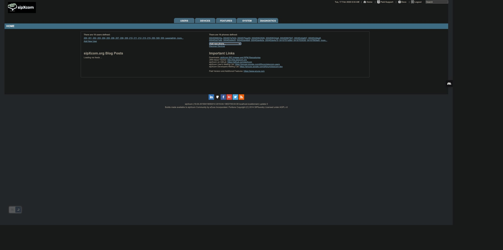
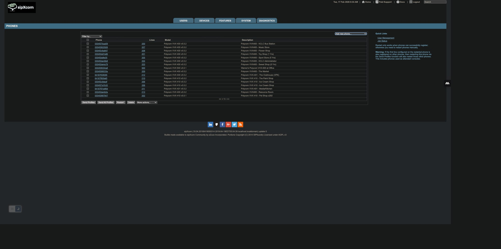
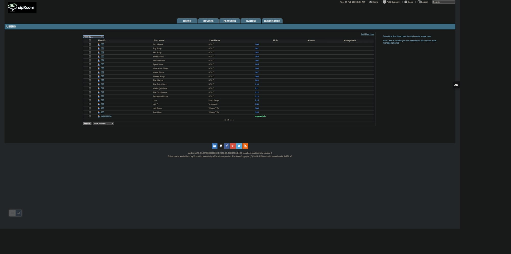
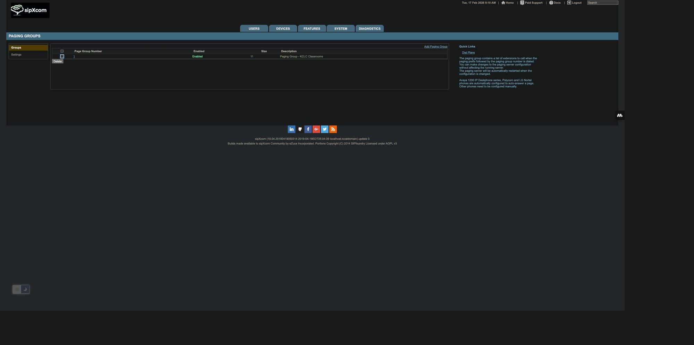
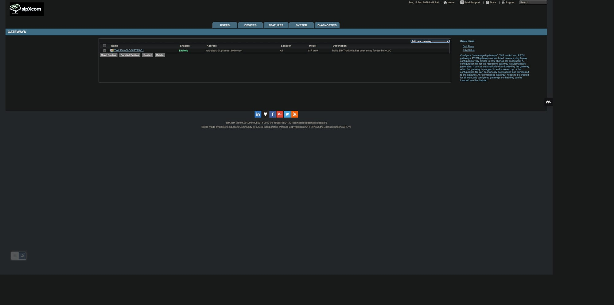
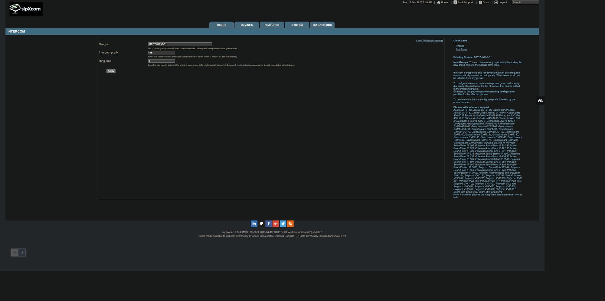
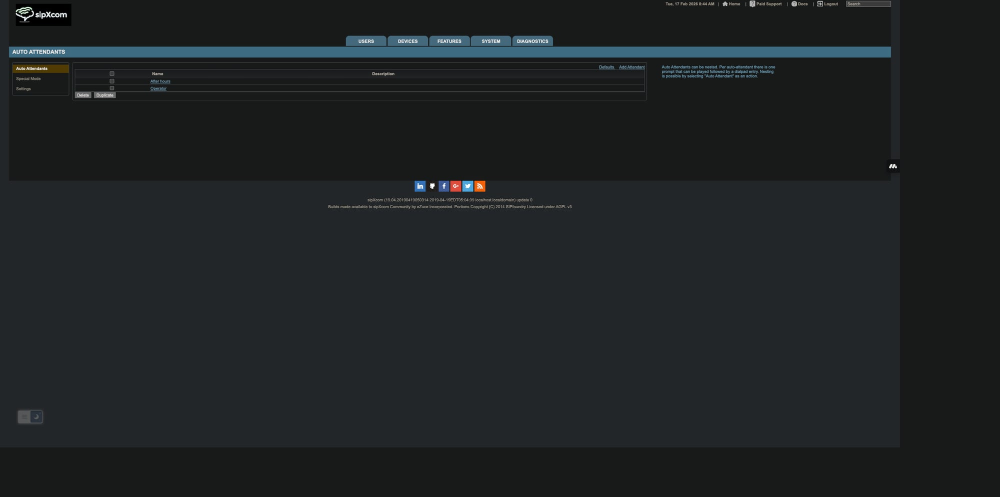
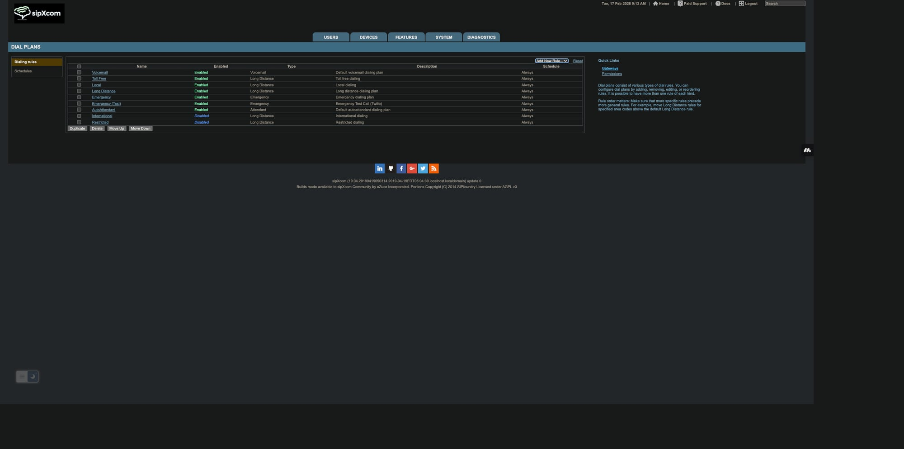
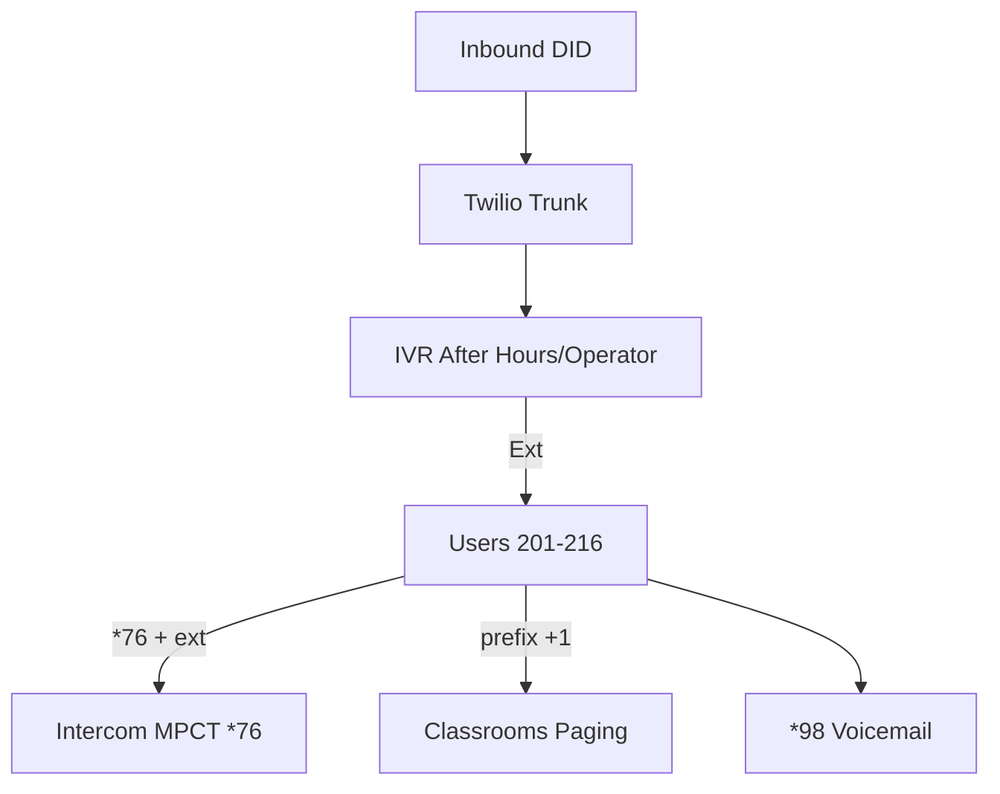

# sipXcom 19.04 Full Discovery - KCLC Zoom Phone Migration

## Exec Summary
- **System**: sipXcom 19.04 on CentOS 6.10 (PostgreSQL 8.4.20 SIPXCONFIG DB)
- **Users**: 19 (201-216,555,630200020)
- **Phones**: 16 Polycom VVX (MAC/ext/model)
- **Trunk**: Twilio SIP (kclc-siptrk-01 +13522680205)
- **IVR**: After hours/Operator
- **Paging**: Group 1 "KCLC Classrooms" (11)
- **Intercom**: MPCT-KCLC-01 *76 (5s)
- **Dialplan**: Voicemail > TollFree > Local > LD > Emergency > Test > AA > Int/Restrict
- **DB**: 165 tables (gateway/dialing_rule/users/user_alias/intercom/paging_group)

## Screenshots

## Mermaid Call Flow

**Detailed**: See docs/*.md

**Migration ready**.